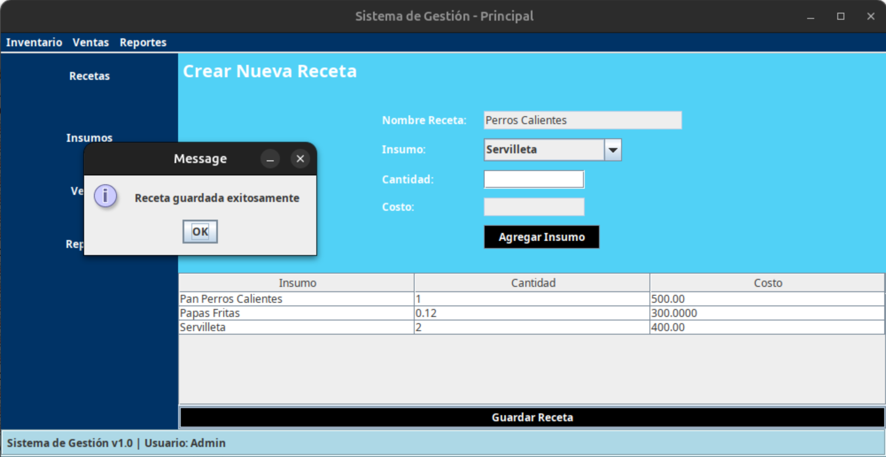

# Gestor de Inventario y Facturacion

## 🛠 Tecnologías utilizadas

- **Backend**: Java, Servlets, EclipseLink  
- **Frontend**: Java Swing  
- **Base de Datos**: MySQL

## 📸 Capturas de pantalla

### Creacion de Insumo

### Crear Receta 

### Se crean las Recetas y se añade de una vez el proceso de la receta

